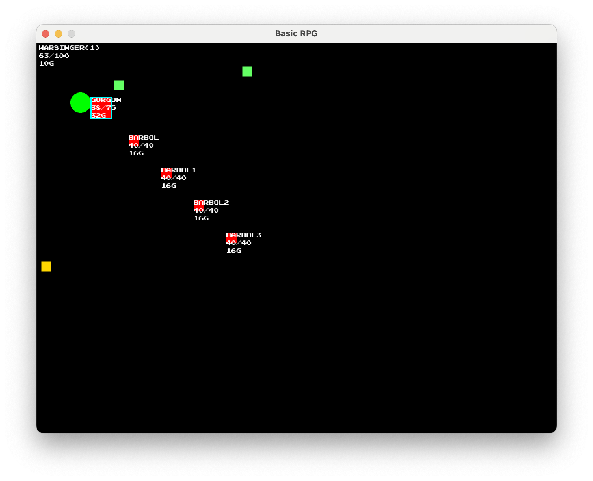
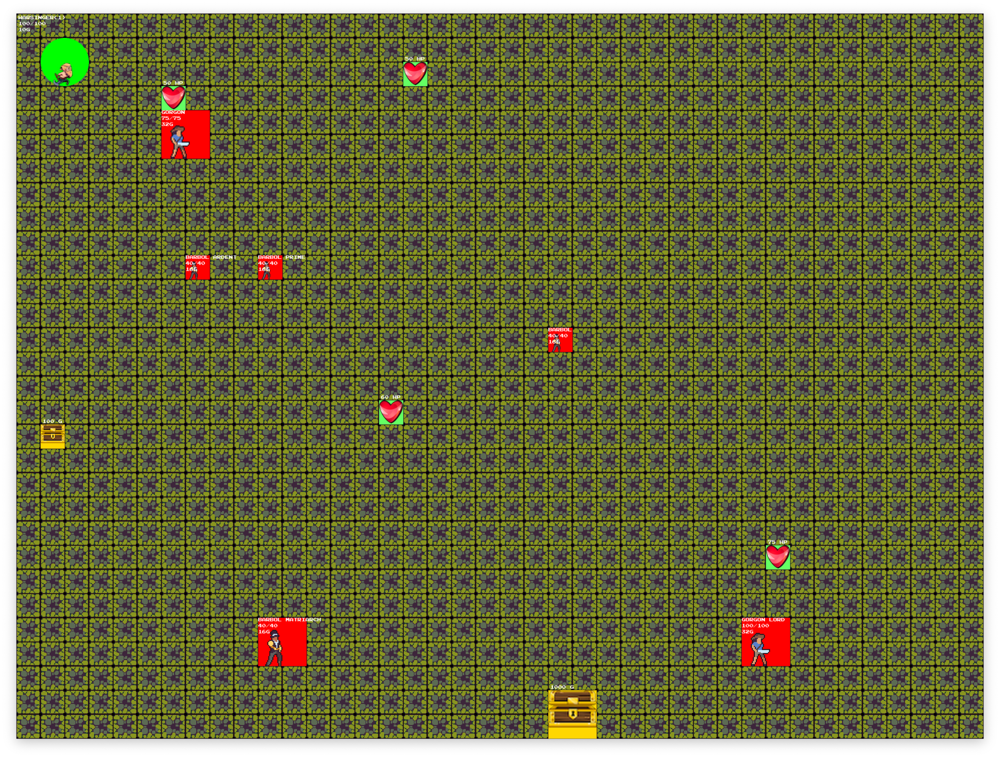

# golang-rpg
Basic RPG written in Go for fun and learning

Attack mosters. Pick up loot. Save the princess?

## Instructions
* Arrow Keys to move
* A key to attack monster when in range
* U key to pick up loot when in range
* R key to reset the game
* F to toggle full screen
* Q key to quit the game

## TODO
* Map
* Monster movement
* Attacker face defender
* ~~Vary monster images~~
* Add real monster images
* Spawning monsters
* Randomize damage (damage dice)
* Add weapons and armor
* ~~Background image~~
* Smooth out drawing during movement
* Cache image loading
* ~~Support variable sprite frame count~~
* Add unit tests

## Screenshots

