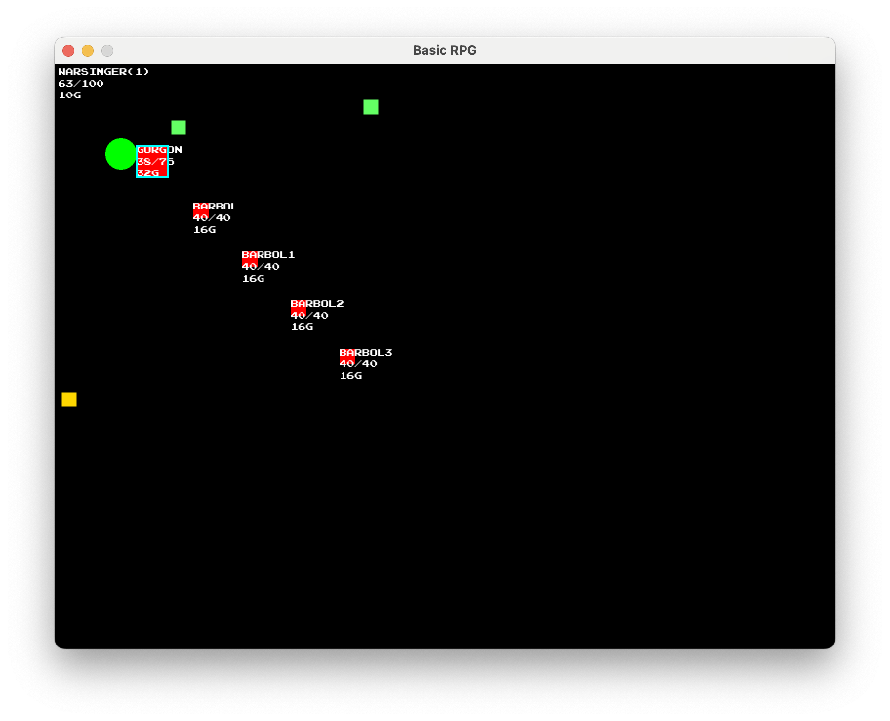

# golang-rpg
Basic RPG written in Go for fun and learning

Attack mosters. Pick up loot. Save the princess?

## Instructions
* Arrow Keys to move
* A key to attack monster when in range
* U key to pick up loot when in range
* R key to reset the game
* Q key to quit the game

